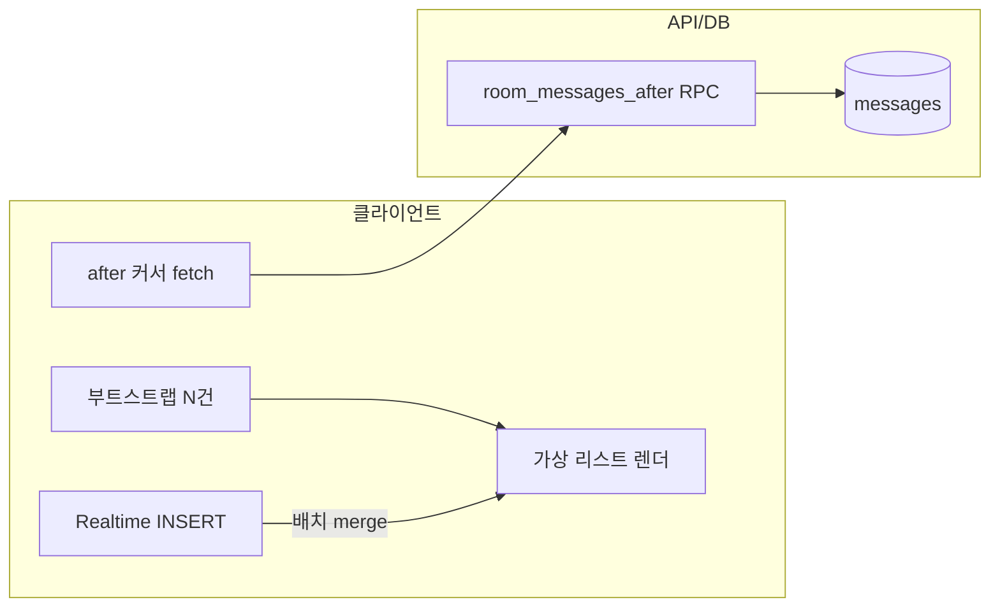

# 100+ 참가자 그룹 채팅 확장

## 아키텍처 요약

| 계층 | 전략 |
|------|------|
| **초기 로드** | `GET .../bootstrap` — 최근 N개만 (기본 30). 전체 이력 미전송 |
| **이전 메시지** | `GET .../messages?before=<id>` — 커서 기준 과거 페이지 |
| **증분 동기** | `GET .../messages?after=<id>` — 마지막으로 본 id 이후만 (탭 복귀·갭 메우기) |
| **실시간** | Supabase `postgres_changes` **방당 1 WebSocket 채널**에 메시지·참가자·방·통화 테이블 묶음 — 사용자별 중복 구독 없음 |
| **클라이언트** | Realtime 이벤트 **rAF 배치**로 `setState` 횟수 감소 · 메시지 리스트 **가상 스크롤** (`@tanstack/react-virtual`) |
| **DB** | `community_messenger_messages_room_idx (room_id, created_at asc)` 로 방+시간 범위 쿼리. 대량 적재 시 **시간 파티셔닝** 검토(아래) |

## 데이터 흐름 (증분)



## DB: 파티셔닝·쿼리 한도

- **일상 운영**: 모든 목록 API는 `LIMIT` + `(room_id, created_at[, id])` 커서로 **전체 스캔 방지**.
- **파티셔닝 (선택, TB급)**: `RANGE (created_at)` 월 단위 파티션 + `room_id` 보조 인덱스. 기존 단일 테이블 → 파티션 테이블 전환은 **짧은 점검 윈도우**에서 마이그레이션 계획 필요.
- **BRIN(선택)**: `created_at`만 대량 순차 삽입되는 경우 보조로 BRIN 고려.

마이그레이션: `20260412160000_community_messenger_messages_after_rpc.sql` — `community_messenger_room_messages_after(...)`.

## API 예시

**증분 (탭 복귀·재연결)**

```http
GET /api/community-messenger/rooms/{roomId}/messages?after={lastSeenMessageId}&limit=80
```

**과거 페이지**

```http
GET /api/community-messenger/rooms/{roomId}/messages?before={oldestLoadedId}&limit=50
```

## 클라이언트 패턴 (요지)

- **배치**: `requestAnimationFrame`으로 여러 Realtime INSERT를 한 번의 `mergeRoomMessages`로 처리.
- **diff**: `mergeRoomMessages`가 id 기준 맵 병합 — 전체 리스트 교체 없음.
- **가상화**: 뷰포트 밖 DOM 미생성으로 100+ 동시 메시지 렌더 비용 완화.

## 추가로 고려할 항목 (미구현 시)

- 참가자 100명일 때 **멤버 스냅샷 슬림화**(페이지네이션·역할만).
- **메타 Realtime**만 긴 디바운스(예: 800ms)로 `refresh` 빈도 감소.
