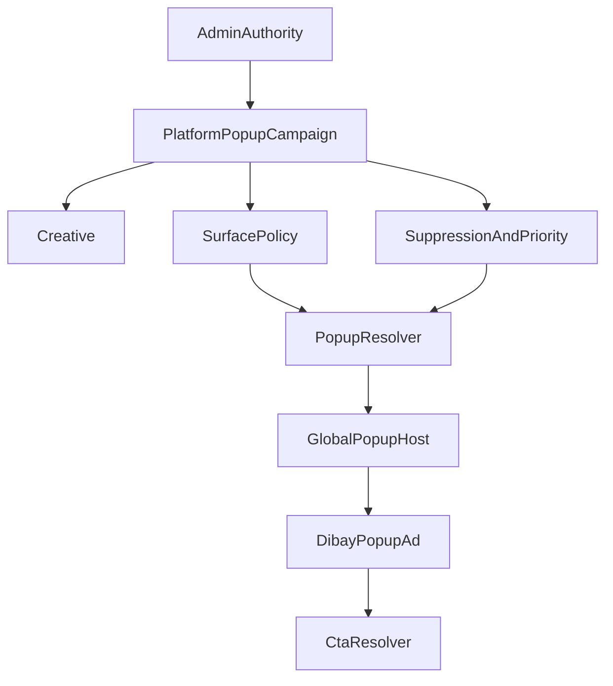

# DIBAY GLOBAL POPUP AD — PRODUCT CONTRACT LOCK

Document status: PRODUCT CONTRACT LOCKED  
Phase: CUT 0-C  
Implementation: BLOCKED  
Pixel contract: NOT LOCKED  
Date: 2026-09-02

## 0. Authority Status

| Field | Value |
|---|---|
| PRODUCT_CONTRACT_LOCKED | YES |
| SURFACE_CONTRACT_LOCKED | YES |
| SUPPRESSION_CONTRACT_LOCKED | YES |
| CTA_CONTRACT_LOCKED | YES |
| PRIORITY_CONTRACT_LOCKED | YES |
| COMMERCIAL_FLOW_LOCKED | YES |
| PIXEL_CONTRACT_LOCKED | NO |
| IMPLEMENTATION | BLOCKED |

This document is the product-authority lock for DIBAY Global Popup Advertising.

This CUT does not authorize implementation.

Hard out of scope:

- DB migrations
- API implementation
- React components
- CSS tokens
- geometry/pixel/ratio locks
- arbitrary Baemin 10-second runtime copying
- absorption of the cross-domain popup authority into Delivery-specific ad tables

## 1. Evidence Boundary

### CUT 0 / CUT 0-B preserved conclusions

#### E1 — Consumer runtime

BAEMIN CONSUMER RUNTIME = NOT_PROVEN

The connected Android device did not have Baemin installed during CUT 0. Exact current-app geometry, frequency, re-exposure, responsive behavior, safe-area behavior, and suppression behavior therefore remain unproven.

#### Public evidence

BAEMIN PUBLIC PRODUCT EVIDENCE = FOUND

Public Baemin advertising/product materials support the existence of a foreground/main-home promotional placement commonly described as 중문배너 / 메인 팝업 배너.

Public evidence supports, at graded levels:

- image-based creative
- landing URL / destination
- main-home foreground exposure
- dedicated close behavior
- promotional creative-first presentation
- a historical public claim of approximately 10-second exposure when not closed

The following remain NOT_PROVEN as current E1 runtime facts:

- exact CSS/runtime geometry
- exact width / max-width
- creative-to-popup ratio
- radius
- horizontal gutter
- backdrop opacity
- exact animation
- exact display delay
- Android back behavior
- dim-tap behavior
- swipe behavior
- TODAY suppression
- DURATION suppression
- CAMPAIGN suppression
- same-session re-exposure
- tab-return behavior
- restart/resume behavior
- tablet contract
- landscape contract
- safe-area exact behavior
- current 2026 behavior equivalence to older public descriptions

Therefore:

VISUAL_DIRECTION_READY = YES  
PIXEL_CONTRACT_READY = NO

No measured or guessed pixel values are authorized by this document.

## 2. Presentation Contract — LOCK

DIBAY Popup Advertising uses a:

**creative-first promotional surface**

The popup advertisement is not a generic application dialog.

### Required presentation rules

- Creative is the visual primary element.
- System chrome is minimal.
- Dismissal controls occupy a separate region below the creative.
- Popup advertising has its own presentation contract.
- DibayOverlayRoot or equivalent global overlay infrastructure may later be reused for portal/backdrop/accessibility behavior.
- Reusing generic overlay infrastructure does not make the popup ad a generic dialog.
- DIBAY green is an action/accent color only.
- The advertisement must not become a large green application card surrounding the creative.
- One production renderer must serve iOS, Android APK, and Tablet.
- Device parity means the same responsive contract, not identical raw pixels.

### Forbidden presentation patterns

The following are explicitly rejected:

- generic centered dialog
- title + body + oversized green CTA card
- feature-local popup
- route-local popup
- separate iOS / Android / Tablet ad renderers
- arbitrary BottomSheet classification without evidence
- visual duplication of Baemin logo, brand color, copy, or creative assets

Presentation class direction:

**lower/home-entry promotional interstitial class**

This does not assert that the implementation is a BottomSheet.

## 3. Surface Contract — LOCK

### Selectable campaign surfaces

Canonical surface values:

- GLOBAL
- COMMUNITY
- TRADE
- DELIVERY
- MYPAGE

### GLOBAL semantic

GLOBAL expands to the default consumer surfaces:

- COMMUNITY
- TRADE
- DELIVERY
- MYPAGE

Admin may also target non-GLOBAL combinations through explicit multi-select surfaces.

### Default excluded surfaces

The following are not advertising surfaces unless a future Owner-approved contract explicitly reopens them:

- MESSENGER
- CALL
- ADMIN
- OWNER_OPS
- PAYMENT
- ORDER_CRITICAL

### Future authority requirement

A central surface resolver is required later:

```text
resolveDibaySurface(path, context)
  → GLOBAL-compatible consumer surface
  → COMMUNITY
  → TRADE
  → DELIVERY
  → MYPAGE
  → excluded/unknown
```

Raw pathname strings must not become Admin campaign SSOT.

This document locks the product semantics only. It does not implement resolveDibaySurface.

## 4. Suppression Contract — LOCK

Popup dismissal and suppression are distinct product behaviors.

| Mode | Availability | Contract |
|---|---|---|
| CLOSE | Always | Ends only the current exposure |
| SESSION | Always | Prevents re-display during the current app session |
| TODAY | Default offered | Hides until the end of the campaign timezone's local calendar day |
| DURATION | Admin-selectable | Hides until canonical suppress_until |
| CAMPAIGN | Admin-selectable | Hides for the applicable campaign revision/lifetime |

### TODAY semantic

TODAY is not equal to 24 hours.

It is defined by the end of the campaign timezone's local calendar day.

### Timezone

Default product timezone:

**Asia/Manila**

A future schema may allow a per-campaign override.

### Authority model

Future implementation must preserve:

- Logged-in users: user-level suppression is canonical.
- Anonymous users: device/local fallback.
- Local cache may accelerate startup.
- Local cache must not become the sole canonical authority for logged-in suppression.

### Important classification

TODAY / DURATION / CAMPAIGN suppression is a DIBAY product requirement.

It must not be described as proven Baemin parity.

## 5. Auto-Dismiss Contract — LOCK

DIBAY Popup Ad v1 default:

**NO AUTO DISMISS**

Do not copy historical public Baemin claims of approximately 10-second exposure into DIBAY runtime.

The advertisement remains until the user:

- closes it,
- chooses a permitted suppression action, or
- activates its CTA.

Future autoDismissSeconds support requires a separate Owner-approved contract reopen and is outside v1.

No automatic countdown is authorized by this document.

## 6. Priority / Collision Contract — LOCK

Popup advertising is a low-priority commercial UI layer.

Critical app interactions always take precedence.

### Deferral precedence

Higher layers:

1. CALL
   - incoming call
   - active call
   - native call transition
2. PAYMENT / ORDER critical operations
   - payment
   - order submit
   - order confirmation
   - gift transfer
3. Application gates / critical UI
   - auth restore
   - permission onboarding
   - address gate
   - critical dialog
4. Eligible popup advertisement

A popup must not cover or compete with the higher-precedence states.

Future implementation must solve this through all relevant layers:

- resolver eligibility
- host deferral
- overlay priority

A z-index-only patch is insufficient.

### Popup-vs-popup resolution

When multiple popup campaigns are eligible:

1. Domain-targeted campaign wins over GLOBAL.
2. Higher campaign priority wins.
3. Earlier start_at wins.
4. Stable campaign identifier provides the final deterministic tie-break.

Resolver result:

- Exactly 0 or 1 winner

Immediate popup chaining after user dismissal is forbidden.

A session cooldown/storm guard is required in the future resolver contract.

## 7. CTA / Landing Contract — LOCK

### Supported interaction

- Whole creative tap is supported.
- Optional native CTA is supported.
- Native CTA must not break creative-first visual hierarchy.
- A large mandatory brand-green system CTA is forbidden.

### Landing preference

Preferred order:

1. Valid DIBAY internal deep link / canonical internal destination.
2. Approved external URL under explicit allow policy.

### Fail-closed requirement

If a landing target is:

- invalid
- deleted
- hidden
- expired
- unauthorized
- otherwise unavailable

the campaign must not create broken navigation.

Future resolver/CTA implementation must fail closed, for example by:

- excluding the campaign from eligibility, or
- rendering a deliberately non-navigating creative only where product policy explicitly allows it.

The implementation must not silently navigate to an unrelated fallback destination.

### Analytics contract

Future event contract:

- popup impression — only after actual on-screen render completion
- popup click
- popup dismiss
- popup suppress
- popup landing success
- popup landing failure

API eligibility response is not an impression.

## 8. Commercial / Approval Contract — LOCK

Commercial popup activation flow:

```text
OWNER REQUEST
  → ADMIN REVIEW
  → ADMIN APPROVAL
  → PLATFORM POPUP CAMPAIGN
  → SCHEDULED / ACTIVE
```

### Authority

- Admin is the final activation authority.
- Payment alone must never activate a popup campaign.
- An Owner cannot self-activate GLOBAL, COMMUNITY, TRADE, or MYPAGE popup exposure.

### Cross-domain ownership

The global popup authority must be a:

**Platform Popup Campaign SSOT**

It must not make the following Delivery-specific structures the global owner:

- store_banner_ad_campaigns
- delivery_ad_inventories

Existing Delivery advertising may later integrate with the Platform Popup Campaign through an approved commercial bridge/request flow, but Delivery tables must not become cross-domain popup SSOT.

## 9. Admin Product Contract — LOCK

The future Admin control center must own:

- campaign identity
- lifecycle/status
- Admin approval
- creative
- surface selection
- schedule
- priority
- suppression options
- CTA / landing
- preview
- reporting

### Preview authority

Admin preview must use the same production renderer as runtime.

A fake preview implementation with unrelated CSS/markup is forbidden.

Preview viewport classes may simulate supported device sizes, but must render the same production component and responsive contract.

## 10. Product Authority Diagram



This is a product authority diagram, not an implementation declaration.

None of the future components/resolvers shown here are claimed to exist unless separately proven in implementation CUTs.

## 11. Geometry Contract — EXPLICITLY NOT LOCKED

The following values are intentionally not locked:

- popup width
- popup max-width
- popup height
- creative source aspect
- creative display aspect
- outer popup aspect
- horizontal gutter
- vertical offset
- lower-anchor offset
- radius
- backdrop opacity
- close-region height
- CTA hit dimensions
- phone max width
- tablet max width
- landscape behavior
- breakpoint thresholds
- safe-area numeric offsets

No developer is authorized to invent these values during implementation.

No arbitrary Tailwind width/radius/gap values may be promoted to SSOT before CUT 0-D.

## 12. Device Contract — PRODUCT ONLY

Future production implementation must use:

**ONE renderer / ONE responsive contract**

for:

- iOS phone
- Android APK
- Tablet

Required outcome:

- same creative hierarchy
- same presentation semantics
- same dismissal semantics
- same CTA semantics
- same safe-area intent
- no clipping
- no overflow
- no tablet over-scaling
- no fixed-phone-pixel assumption

This does not authorize any numeric device token.

## 13. Current Architecture Facts Preserved

The previous architecture audit remains accepted.

Preserved facts:

- DIBAY currently has no Global Popup Ad authority.
- Delivery Ads and Feed Ads are separate authorities.
- Generic DibayOverlayRoot infrastructure exists.
- Popup suppression SSOT does not currently exist.
- GlobalPopupHost does not currently exist.
- resolveDibaySurface does not currently exist.
- resolvePopupAd does not currently exist.
- Incoming-call and generic dialog stacking have an identified collision risk.
- Route-local popup implementations are not acceptable.
- Delivery-specific tables must not be promoted into global popup ownership merely for implementation convenience.

These facts must not trigger a broad re-audit unless new contradictory evidence appears.

## 14. Implementation Gate

Implementation remains blocked.

Before implementation, CUT 0-D must provide enough measured evidence to lock the geometry contract.

Required next-phase evidence includes, where obtainable:

- recent Baemin/public or actual-runtime popup visual evidence
- popup/creative/dismiss-region proportional measurements
- phone geometry evidence
- creative aspect verification
- responsive behavior evidence
- Tablet evidence where possible
- landscape behavior where possible
- safe-area behavior where possible

Evidence may be graded.

Public mockup measurements must be labelled:

**PUBLIC_MOCKUP_MEASURED**

They must not be presented as runtime CSS measurements.

Actual installed-app measurements must be labelled separately as runtime evidence.

## 15. Hard Prohibitions Until CUT 0-D

Until Pixel Contract is explicitly locked:

```text
NO MIGRATION
NO API
NO POPUP COMPONENT
NO CSS TOKEN
NO RANDOM MAX-WIDTH
NO RANDOM ASPECT
NO RANDOM RADIUS
NO HARDCODED 24H
NO BAEMIN 10S COPY
NO ROUTE-LOCAL POPUP
NO DEVICE-SPECIFIC DUPLICATE RENDERER
NO DELIVERY TABLE ABSORPTION
NO FAKE TABLET PARITY
NO FAKE PASS
```

## 16. Final Lock Matrix

| Field | Value |
|---|---|
| PRODUCT_CONTRACT_LOCKED | YES |
| SURFACE_CONTRACT_LOCKED | YES |
| SUPPRESSION_CONTRACT_LOCKED | YES |
| CTA_CONTRACT_LOCKED | YES |
| PRIORITY_CONTRACT_LOCKED | YES |
| COMMERCIAL_FLOW_LOCKED | YES |
| PRESENTATION_CONTRACT_LOCKED | YES |
| AUTO_DISMISS_CONTRACT_LOCKED | YES — NO AUTO DISMISS v1 |
| ADMIN_AUTHORITY_LOCKED | YES |
| PIXEL_CONTRACT_LOCKED | NO |
| IMPLEMENTATION | BLOCKED |

### Next authorized CUT

**CUT 0-D — MEASURED GEOMETRY LOCK**

Only after CUT 0-D is accepted may implementation CUTs begin.

### Owner Principle

The success condition is not:

“A popup appears.”

The success condition is:

A DIBAY-native, creative-first promotional popup system whose campaign, surface, approval, suppression, priority, landing, preview, analytics, device behavior, and critical-UI deferral are governed by one coherent authority — without inventing geometry before evidence exists.

Until measured geometry is locked:

**PRODUCT LOCKED. PIXELS UNLOCKED. IMPLEMENTATION BLOCKED.**
