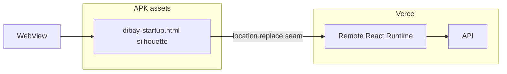

# DIBAY Hybrid Local Shell EPIC — 현황 정정 (P2)

> **SSOT 승격:** 복구·최종 목표는 [`docs/dibay-local-runtime-startup-rearchitecture.md`](./dibay-local-runtime-startup-rearchitecture.md).  
> 본 문서는 **과거에 만든 Hybrid 경로의 기록·잔존 계약**이다. Local First / Legacy-level Complete로 읽지 않는다.

## 현재 판정 (고정 · 2026-07-27)

| 항목 | 판정 |
|------|------|
| 아키텍처 | **Hybrid Remote Startup** |
| Local | first-pixel presentation only (`dibay-startup.html` 실루엣) |
| Runtime primary | **Remote** Next document + `_next` JS |
| Seam | `location.replace` + Native Handoff Cover (transition / mitigation) |
| Android | **PARTIAL** (로컬 부트 HTML 존재, Runtime은 Remote) |
| iOS | **FAIL / RUNTIME 미검증** (검은 화면·로고 미표시 보고 = Startup P0) |
| Cross-platform parity | **FAIL** |
| Local Runtime | **NOT IMPLEMENTED** |
| PRODUCT PASS | **금지** |

### 철회하는 표현

다음 표현은 **증거 없이 사용하지 않는다** (과거 문서·커밋 메시지에 남아 있어도 현 상태로 승격하지 않음).

- Local First PASS
- Startup Architecture Complete
- Legacy App 수준 완료
- Phase E Product Complete
- Startup PASS / Legacy Startup PASS

## 실제 Boot chain (Hybrid — 현재 production 경로)

```text
Native
  → WebView (server.url origin)
    → Local Boot HTML (APK intercept / iOS loadHTMLString)
      → fake AppShell silhouette
        → Native Cover (mitigation)
          → location.replace(remote)
            → Remote HTML
              → Remote React
                → ConditionalAppShell / Home
```



## Phase A–E가 실제로 한 일 (과대 해석 금지)

| Phase | 한 일 | 하지 않은 일 |
|-------|--------|--------------|
| A–D | splash/`shellReady`/redirect/feed first-paint 정리 | Local Runtime |
| E | APK 부트 HTML + intercept + replace 인계 | Remote를 Data-only로 강등 |
| Cover | blank-frame **완화 시도** | 최종 제품 계약 |

Cover / `location.replace` / Boot HTML 실루엣은 **전이·응급**이다. 최종 구조로 잠그지 않는다.

## Hybrid WIP 보존

| 위치 | 내용 |
|------|------|
| Branch `archive/startup-hybrid-handoff-wip` (`643e18a0d`) | Cover / triggerEvent / paint-gate WIP |
| `.qa-logs/startup-hybrid-handoff-wip.patch` (해당 브랜치) | 동일 diff 백업 |

main에서 Hybrid 완화를 Local Runtime과 섞지 않는다. Hybrid 코드 **즉시 삭제 금지** — Local Runtime cutover 후 Reference Audit → 제거.

## 복구 목표 (옵션 A)

```text
Native Host
  → Bundled Local Runtime
    → Local AppShell
      → Remote Data / Config / API / Sync
        → Interactive
```

상세·상태 머신·QA·제거 조건: **`docs/dibay-local-runtime-startup-rearchitecture.md`**.

## 잔존 Hybrid 참고 (삭제 전까지)

- Android: `DibayBridgeWebViewClient` → `assets/dibay-startup.html`
- iOS: `DibayStartupBridgeViewController.loadHTMLString`
- `server.url` 유지 (Hybrid 경로)
- Admin startup-config API · 캐시 키 (`lib/startup/*`)
- `verify:startup-architecture` — Hybrid 정적 계약 (Local Runtime verify로 교체 예정)
