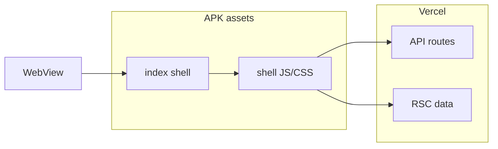

# DIBAY Hybrid Local Shell EPIC (P2)

**상태:** 설계 · Boot P0 범위 **외**  
**목표:** 카카오톡·배민처럼 APK 내 **앱 셸(JS/CSS)** 을 내장하고 API·RSC만 원격 로드.

## 현재 한계 (remote-only)

- `capacitor.config.ts` — `server.url` → Vercel 전체 HTML/JS 매 cold start 네트워크 의존
- 네이티브 splash·WebView bg·skeleton 으로 **체감** 개선 가능하나 **0.3s shell** 하한은 번들 미내장 구조상 존재

## 목표 아키텍처

## 단계 (제안)

1. **Shell subset export** — AppShell·BottomNav·design tokens·i18n ko/en minimal 번들
2. **`cap sync`** — `webDir` 에 shell static + `server.url` 은 API origin only 또는 hybrid fallback
3. **Stale-while-revalidate** — SW 또는 Capacitor HTTP cache for `/_next/static/*`
4. **계약** — boot Stage 1~3 유지; shell local, hydrate remote

## P0 선행 완료

- Splash hide = `homeVisible` (not apiDone)
- Boot Stage shell / hydrating / ready
- `(main)/layout` server await 제거
- `window.__dibayBootMetrics` end-to-end

## EPIC 종료 기준

| 항목 | 목표 |
|------|------|
| 아이콘→shell (offline shell only) | ≤500ms |
| 첫 API | background after shell |
