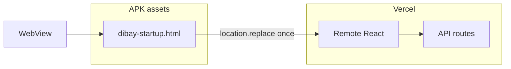

# DIBAY Hybrid Local Shell EPIC (P2)

**상태:** Phase A–E **제품 적용** — Local Boot Shell(Intro+AppShell+BottomNav) APK 내장 · Remote React 단일 인계  
**목표:** 카카오톡·배민처럼 아이콘 탭 즉시 로컬 셸 paint, API/피드 권위는 원격 유지.

## 2026-07-26 — Cold Boot 계약 전환 (완료)

| RC | 조치 |
|----|------|
| RC-3 `/` redirect | `app/(main)/page.tsx` 가 Philife 홈 직접 렌더 — HTTP redirect 제거 |
| RC-2 splash | dismiss = `shellReady` (`ConditionalAppShell`) — timeout gate 제거 |
| RC-4 feed | Suspense/RSC first paint 제거 · persistent localStorage cache → background patch |
| RC-1 remote WebView | **Phase E로 해소** — `/__dibay-startup` APK asset intercept (server.url 유지) |

## 2026-07-27 — Phase E Local Boot Shell (완료) + Native Handoff Cover (코드)

- `server.url` 유지 (Capacitor 브릿지·쿠키·origin 보존)
- Android: `DibayBridgeWebViewClient.shouldInterceptRequest` → `assets/dibay-startup.html`
- iOS: `DibayStartupBridgeViewController.loadHTMLString(baseURL=origin/__dibay-startup)` — 기기 QA BLOCKED
- Boot HTML: Intro 종료 → Local AppShell paint(rAF×2) → Native Handoff Cover → `location.replace` 1회 인계
- Native Cover: 크림+DIBAY 로고+하단 nav 실루엣 · `beginHandoffCover`(pre-draw sync) / `endHandoffCover`(shellReady only, idempotent) · 로드 실패 시 Cover 위 재시도
- Admin: `/admin/settings/startup-config` · `GET/PUT /api/.../startup-config` · PUT→DB E2E **BLOCKED**(세션 없음)
- Legacy cold-boot-intro / dibay-boot-metrics 경로 삭제 · `verify:startup-architecture`
- Windows: 타깃 없음 → **BLOCKED** (Web Cold PASS 대체 금지)

## 현재 한계 (잔여)

- Remote React HTML/JS 는 인계 후 Vercel 로드 (정적 `_next/static` APK 번들 미포함 — 버전 스큐 회피)
- iOS / Tablet 실기기 QA **BLOCKED**
- Local→Remote blank-frame 0 판정: Native Cover APK 재빌드·양기기 cold×5 프레임 QA 필요 (`46311d6c3`)

## 목표 아키텍처 (Phase E — 적용)

## EPIC 종료 기준 (Local Shell)

| 항목 | 목표 | 상태 |
|------|------|------|
| 아이콘→local shell paint | 네트워크 HTML 대기 없이 | Android 구현 |
| 단일 Intro | Native→Local→Remote 이중 인트로 0 | 계약+handoff 플래그 |
| 첫 API / Feed authority | remote only | 유지 |
| iOS/Tablet/Windows QA | 실기기 | BLOCKED |
