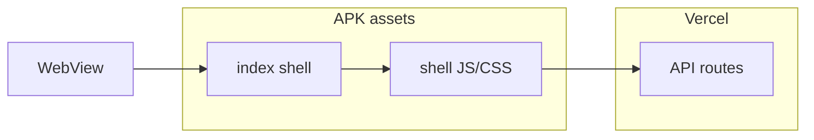

# DIBAY Hybrid Local Shell EPIC (P2)

**상태:** Phase A–D (Shell/Cache-First Cold Boot) **제품 적용 완료** · Local Shell 번들화는 **잔여 상한**  
**목표:** 카카오톡·배민처럼 APK 내 **앱 셸(JS/CSS)** 을 내장하고 API만 원격 로드.

## 2026-07-26 — Cold Boot 계약 전환 (완료)

| RC | 조치 |
|----|------|
| RC-3 `/` redirect | `app/(main)/page.tsx` 가 Philife 홈 직접 렌더 — HTTP redirect 제거 |
| RC-2 splash | dismiss = `shellReady` (`ConditionalAppShell`) — timeout gate 제거 |
| RC-4 feed | Suspense/RSC first paint 제거 · persistent localStorage cache → background patch |
| RC-1 remote WebView | **잔여** — 아래 EPIC. JS/HTML 은 여전히 Vercel 로드 |

## 현재 한계 (remote-only · RC-1)

- `capacitor.config.ts` — `server.url` → Vercel HTML/JS 매 cold start 네트워크 의존
- `capacitor-www` 는 `server.url` 없을 때만 쓰는 빈 index
- Local shell 미내장 시 **아이콘→첫 HTML** 하한은 네트워크 RTT에 묶임 (Cache-First 피드와 별개)

## 목표 아키텍처 (Phase E — 미완)

## 단계 (제안)

1. **Shell subset export** — AppShell·BottomNav·design tokens·i18n ko/en minimal 번들
2. **`cap sync`** — `webDir` 에 shell static + API origin remote
3. **Stale-while-revalidate** — SW 또는 Capacitor HTTP cache for `/_next/static/*`
4. **계약** — shellReady splash · persistent feed cache 유지

## 선행 완료 (제품 Cold Boot)

- Splash hide = `shellReady` (not feed/apiDone) · safety timeout gate 제거
- `/` = Philife home · redirect 없음
- Feed first paint = persistent cache · network background patch
- `(main)/layout` server await 제거
- `window.__dibayBootMetrics` end-to-end

## EPIC 종료 기준 (Local Shell)

| 항목 | 목표 |
|------|------|
| 아이콘→shell (offline shell only) | ≤500ms |
| 첫 API | background after shell |
| Feed first paint | persistent cache (이미 충족) |
