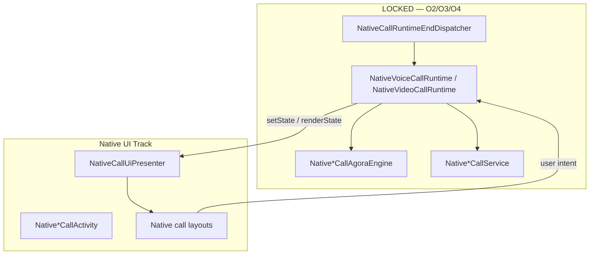

# DIBAY Native Call UI — Design (Post O4 HARD LOCK)

Status: **Design only** — no implementation approval in this document.

Prerequisite locks: **O2 Establishment**, **O3 Connected Sync**, **O4 End Ownership** (see `docs/dibay-call-o4-end-ownership-hard-lock.md`).

## 1. Goal

Replace Web `CallV4Screen` / legacy Web outgoing-incoming surfaces with **native Android Activities/Fragments** that **render Runtime state only**. Establishment, connected sync, and end/cleanup remain Runtime-owned. UI must not become a second owner of Agora, session, FGS, or cleanup.

## 2. Fixed Principles

| Principle | Rule |
|---|---|
| Runtime is Owner | Session, Agora join/leave, FGS, cleanup, terminal dispatch stay in `Native*CallRuntime` |
| UI renders state | UI reads `Session` + `State` and calls Runtime **intent APIs** only (`accept`, `reject`, `end`, toggles) |
| No Web call screen | Do not restore `/calls-v4` Web establishment or JS Agora for native-owned calls |
| No legacy modal reuse | Do not preserve Web top modal / legacy outgoing sheet as call UI |
| O4 untouched | UI work must not modify `NativeCallRuntimeEndDispatcher`, `onRemoteTerminal`, or `cleanup` chains |
| Visible surface SSOT | `NativeCallVisibleSurfaceOwner` remains the cross-lane visible-surface gate |

## 3. Runtime State → UI Phase Map

Both `NativeVoiceCallRuntime` and `NativeVideoCallRuntime` share:

```
RINGING → ACCEPTING → CONNECTING → CONNECTED → ENDING → ENDED / FAILED
```

| Runtime `State` | UI phase | Direction notes |
|---|---|---|
| `RINGING` | **Incoming** | Callee only (`initiator=false`) |
| `ACCEPTING` | **Connecting** | Post-accept, pre-join |
| `CONNECTING` | **Dialing** (outgoing) or **Connecting** (incoming) | Outgoing starts here (`initiator=true`) |
| `CONNECTED` | **Connected** | Both directions |
| `ENDING` / `ENDED` / `FAILED` | **Teardown** (non-interactive) | Activity finishes via Runtime |

**Current gap (to fix in UI track, not O4):**

- Voice Runtime calls `NativeVoiceCallActivity.renderState` only when `!session.initiator` — outgoing voice has **no native Activity today**; WebView shows call chrome.
- Video Runtime renders all states, but outgoing Activity launch is still minimal / inconsistent with product UI.

UI track closes this gap by launching native outgoing surfaces without changing establishment or cleanup ownership.

## 4. Architecture



**Allowed UI → Runtime calls:**

- `Native*CallRuntime.accept(context, callId)`
- `Native*CallRuntime.reject(context, callId)`
- `Native*CallRuntime.end(context, callId)`
- `Native*CallAgoraEngine.setSpeakerEnabled` / `setCameraEnabled` (media controls only)

**Forbidden UI → system calls:**

- `Native*CallAgoraEngine.join` / `leave`
- `Native*CallRuntime.cleanup` direct
- `NativeCallRuntimeEndDispatcher.dispatch`
- `DibayActiveCallSessionManager` legacy cleanup
- Web `cleanupCallV4` / JS Agora

## 5. Native Dialing UI (Outgoing — CONNECTING)

**When:** `session.initiator=true` and `state=CONNECTING` (voice outgoing currently skips Activity — this is the primary new surface).

**Purpose:** Show outgoing ringing/dialing feedback while Runtime fetches token and joins Agora (O2 locked path).

**Layout (voice):**

- Peer name + avatar (from `Session.callerName` / room peer metadata)
- Status: “Calling…” / localized equivalent
- Cancel button → `Native*CallRuntime.end(context, callId)` (local end → O4 `plugin_end_call` path)

**Layout (video):**

- Same header row
- Local camera preview container (attach via existing `NativeVideoCallAgoraEngine` local surface hook)
- Cancel button

**Launch:**

- Runtime `setState(CONNECTING)` for initiator → start `Native*CallActivity` with `surface=dialing` claim via `NativeCallVisibleSurfaceOwner`
- Do **not** route through MainActivity WebView

**Logs (QA):**

- `native_dialing_surface_shown`
- Must not emit Web `route_to_screen` / `screen_mounted`

## 6. Native Incoming UI (Callee — RINGING)

**When:** `session.initiator=false` and `state=RINGING`.

**Purpose:** Lock-screen / background / FSI incoming surface (replaces placeholder Button layout).

**Layout:**

- Full-screen incoming card: caller name, avatar, media badge (voice/video)
- Primary actions: Accept / Decline
- Optional: swipe or large tappable targets for lock use

**Behavior:**

- Accept → `Native*CallRuntime.accept` (O2 locked accept path)
- Decline → `Native*CallRuntime.reject`
- Uses existing wake flags (`applyWakeFlags`) — do not move to manifest/styles (see `community-messenger-native-call-receive.md`)

**Existing code base:** `NativeVoiceCallActivity` / `NativeVideoCallActivity` placeholder — **replace in place**, do not add parallel Activity.

## 7. Native Connecting UI (ACCEPTING / CONNECTING incoming)

**When:** Callee after accept, before `CONNECTED`; also outgoing if token/join retry UI needed.

**Layout (voice):**

- “Connecting…” + peer name
- End button (abort)

**Layout (video):**

- Local preview full or PIP placeholder
- Remote container empty until Agora remote callback
- End button

**Surface:** Transition from ring layout to connecting layout inside same Activity (no second Activity).

## 8. Native Connected UI (CONNECTED)

**When:** `state=CONNECTED` for both directions.

**Layout (voice):**

- Peer name + call duration timer (UI-local timer started on `renderState(CONNECTED)`)
- Controls: mute, speaker, end
- End → `Native*CallRuntime.end` → O4 local end chain

**Layout (video):**

- Remote video full bleed
- Local preview PIP (existing `attachLocalView` / `attachRemoteView`)
- Controls: camera toggle, end
- `NativeVideoCallAgoraEngine.onRemoteRenderSurfaceReady` on enter (existing)

**Web bridge (O3 locked):**

- Runtime continues `native_connected_emit` → Web ops hydration
- Native Connected UI is **visible** layer; Web sync must not be replaced by UI

## 9. Voice vs Video Application Order

Per red-team sequence:

1. Design (this document) ✓
2. Voice UI apply — `NativeVoiceCallActivity` + outgoing dialing launch in Voice Runtime **UI hook only**
3. Video UI apply — `NativeVideoCallActivity` + symmetric outgoing dialing
4. PiP — video connected only; Runtime owns surface attach/detach
5. Dock — collapsed connected chip; must not own session

## 10. PiP & Dock (Design Preview — Steps 7–8)

**PiP (video only, CONNECTED):**

- Enter PiP from Connected UI user action
- `NativeVideoCallAgoraEngine` surfaces move with Activity; PiP mode = layout/orientation only
- End from PiP → same `Runtime.end` → O4 chain

**Dock (voice + video, CONNECTED):**

- System overlay / in-app mini bar showing peer + duration + end
- Dock reads Runtime snapshot; tap expands to full Connected Activity
- Dock must not call cleanup or join

Detailed PiP/Dock specs come after Connected UI PASS.

## 11. Files — Allowed vs Forbidden

### Allowed (UI track, with approval)

| Area | Files |
|---|---|
| Voice UI | `NativeVoiceCallActivity.java`, new layout/resources under `android/app/src/main/res/` |
| Video UI | `NativeVideoCallActivity.java`, video layouts |
| Presenter glue | New `NativeCallUiPresenter.java` (state → view model, no ownership) |
| Runtime UI hooks | **Minimal** `setState` launch/finish hooks in `Native*CallRuntime` — render/lifecycle only, no O2/O3/O4 logic change |
| Visible surface | `NativeCallVisibleSurfaceOwner.java` — state labels only |

### Forbidden (LOCK)

| Track | Files / areas |
|---|---|
| O4 | `NativeCallRuntimeEndDispatcher`, `onRemoteTerminal`, `cleanup`, terminal plugin dispatch |
| O2 | `Native*CallAgoraEngine` join/create, `NativeCallEngineOwnership`, outgoing handoff/quarantine |
| O3 | `native-connected-sync`, `CallV4Provider` bootstrap, connected emit bridge |
| Web | `CallV4Screen`, `call-v4-agora*`, `/calls-v4` as native-owned UI |
| Legacy | Web incoming modal/sheet as native substitute |

## 12. End / Cleanup UX (O4 — read only)

UI End button calls `Runtime.end` only. Cleanup chain is fixed:

```
Runtime.end / terminal
  → native_end_dispatch
  → runtime_cleanup_start
  → agora_native_disconnected
  → native_call_service_stop
  → cleanup_done
  → Activity.finishIfActive
```

UI must not add retry loops, alternate cleanup, or dispatcher bypass.

## 13. Verification Plan (UI track — future)

| Gate | Command / check |
|---|---|
| O2 regression | `npm run verify:native-voice-runtime-contract`, video counterpart |
| O3 regression | `.qa-logs/o3-connected-device-qa.mjs` |
| O4 regression | `.qa-logs/o4-end-ownership-matrix.mjs` |
| UI smoke | New harness: native dialing/incoming/connected surface markers, Web `route_to_screen=0` for native-owned callIds |

## 14. Implementation Approval Boundary

This document approves **design only**. Implementation requires separate red-team approval per step:

1. Voice Dialing + Incoming + Connecting + Connected UI
2. Video UI apply
3. PiP
4. Dock

Each step must pass O2/O3/O4 regression before the next.
