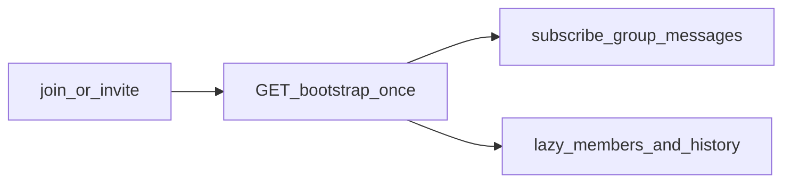

# 확장 가능한 그룹 채팅 아키텍처 (100+ 멤버)

요약 인덱스. 상세는 하위 문서를 따른다.

---

## 목표

- 빠른 방 오픈: **단일 부트스트랩** + Realtime 은 성공 후 1채널.
- 낮은 Realtime 부하: **메시지 테이블** 구독만; 타이핑은 Broadcast.
- 안정적 unread: **시퀀스 차이** 또는 O(1) 증감 — `COUNT(*)` 금지.
- 프레즌스: **샘플 + throttle** — 전원 동기화 없음.
- 메시지 중복 최소: INSERT 1회 + 클라이언트 id dedupe.
- UI 배치: rAF flush + 임계치 이상 **가상화**.

---

## API (서버 라우트)

| 메서드 | 경로 | 설명 |
|--------|------|------|
| POST | [`/api/group-chat/rooms`](../app/api/group-chat/rooms/route.ts) | 방 생성 + 소유자 멤버십 |
| GET | [`/api/group-chat/rooms/[roomId]/bootstrap`](../app/api/group-chat/rooms/[roomId]/bootstrap/route.ts) | 단일 부트스트랩 |
| POST | [`/api/group-chat/rooms/[roomId]/join`](../app/api/group-chat/rooms/[roomId]/join/route.ts) | 참여 / 재입장 |
| GET | [`/api/group-chat/rooms/[roomId]/messages`](../app/api/group-chat/rooms/[roomId]/messages/route.ts) | 키셋 목록 |
| POST | 동일 | 메시지 전송 (`seq` 는 DB 트리거) |
| POST | [`/api/group-chat/rooms/[roomId]/read`](../app/api/group-chat/rooms/[roomId]/read/route.ts) | 읽음 (`last_read_seq`) |

로더: [`lib/group-chat/server/load-group-room-messages.ts`](../lib/group-chat/server/load-group-room-messages.ts).

클라 Realtime: [`useChatRoomRealtime`](../lib/chats/use-chat-room-realtime.ts) 에 `mode: "group"` — `group_messages` `postgres_changes` + [`groupMessageRowToChatMessage`](../lib/group-chat/map-group-message-row.ts).

---

## 문서 맵

| 주제 | 문서 |
|------|------|
| 스키마·`chat_*` 분리 | [group-chat-schema.md](./group-chat-schema.md) |
| 부트스트랩 캡·Lazy | [group-chat-bootstrap.md](./group-chat-bootstrap.md) |
| Realtime·RLS | [group-chat-realtime.md](./group-chat-realtime.md) |
| 프레즌스·타이핑 수치 | [group-chat-presence-typing.md](./group-chat-presence-typing.md) |
| 가상화·최적화 모드 | [group-chat-ui-performance.md](./group-chat-ui-performance.md) |
| 단일 부트스트랩 공통 계약 | [messenger-bootstrap-contract.md](./messenger-bootstrap-contract.md) |
| 성능 한도·그룹 인원 | [messenger-performance-targets.md](./messenger-performance-targets.md) §2 |
| 핫/콜드 메시지 | [messenger-db-archive-roadmap.md](./messenger-db-archive-roadmap.md) |

---

## 플로우 요약

---

## 관리·모더레이션

- 역할: `owner` / `moderator` / `member` — 스키마는 [group-chat-schema.md](./group-chat-schema.md).
- 추방·숨김·고정·레이트 리밋은 **감사 로그** + 동일 메시지 스트림의 UPDATE/DELETE 로 전파 (별도 N명 알림 없음).

---

## 메시지 보관

- 핫 테이블 + 키셋 인덱스; 콜드는 아카이브 배치. [messenger-db-archive-roadmap.md](./messenger-db-archive-roadmap.md) 와 동일 원칙.
