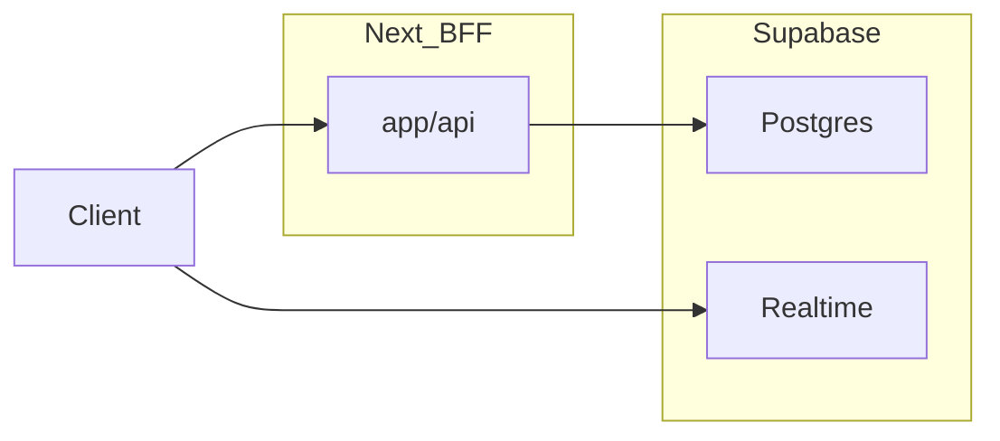

# Next.js + Supabase 메신저: 유지 vs 최적화 vs 분리 (실무 평가)

도메인별로 **지금 Supabase에 두어도 되는지**, **먼저 DB/Realtime 안에서 줄일 것**, **나중에 별도 서비스를 검토할지**를 정리한다. 분리 시점의 정량 신호는 [messenger-service-split-criteria.md](./messenger-service-split-criteria.md)와 같다.

## 현재 구조와 전제 (코드 기준)

- **영속 데이터·RLS**: Postgres(Supabase)가 채팅 메시지·방·주문 채팅 등의 원천으로 적합하다.
- **Realtime**: `postgres_changes` 기반 — 커뮤니티는 방 단위 채널 번들링(`lib/community-messenger/use-community-messenger-realtime.ts`), 거래는 방 단위 구독(`lib/chats/use-chat-room-realtime.ts`).
- **통화 시그널**: 일반 메시지와 이미 분리(`lib/chat-domain/ports/call-signaling-boundary.ts`, `community_messenger_call_signals`, `app/api/community-messenger/calls/*`).

## 도메인별 판단

| 도메인 | 1. 지금 Supabase에 두어도 됨 | 2. 먼저 Supabase 안에서 최적화 | 3. 결국 별도 서비스/레이어 검토 | 4. 이유 |
|--------|-------------------------------|--------------------------------|----------------------------------|---------|
| **Chat messages** | 예 — 저장·조회·커서 페이지의 기본 | 인덱스·핫/콜드 파티션·부트스트랩 슬림·아카이브 로드맵([messenger-db-archive-roadmap.md](./messenger-db-archive-roadmap.md)) | 극단적 쓰기/검색 QPS: 읽기 복제, 전용 검색·아카이브 스토어 | 테이블 무한 성장 + 전역 검색이 메인 DB에 몰리면 병목 |
| **Room state** | 예 — 메타·멤버십은 관계형에 적합 | 짧은 TTL 캐시(BFF)·조인 축소·부트스트랩 필드 최소화([messenger-bootstrap-contract.md](./messenger-bootstrap-contract.md)) | 극단적 room 메타 패치 QPS: 이벤트 소싱/캐시 레이어 | 핫 row 업데이트가 생기면 DB가 먼저 달음 |
| **Presence** | 조건부 — 소규모는 가능 | 샘플링·대그룹 제한·TTL; Realtime 연결 수 모니터링 | 고부하 시 전용 presence(예: Redis) 또는 edge 집계 | 연결·이벤트 비용에 민감; 팬아웃이 커지면 먼저 터짐 |
| **Unread counters** | 예 — 참가자/역할별 컬럼(주문 채팅 패턴 등) | 읽음 처리 디바운스·배치·인덱스·중복 제거 | 초고 QPS 읽음: 카운터 전용 스토어/스트림 처리 | 동일 row 반복 UPDATE가 핫스팟 |
| **Typing state** | ephemeral는 가능하나 부담 큼 | 디바운스·그룹에서는 소수만·DB 저장 회피 | 지속적 고빈도면 전용 경량 채널 | 가치 대비 이벤트 수가 큼; 커뮤니티 Realtime 주석은 “별 토픽·초경량” 권장 |
| **Call signaling** | 예 — 메시지와 분리된 테이블/API 유지가 맞음 | 레이트리밋·짧은 TTL·ICE 라우트 안정화 | 대규모 시 지역 POP 근처 시그널링/SFU 연동 강화 | 지연 민감; DB는 시그널 메타만 |
| **Media sessions** | 예 — 세션 메타는 DB, 미디어 바이트는 외부 | 세션 상태 정리 job·인덱스 | 미디어 경로 자체는 항상 외부(WebRTC/Agora 등) | Supabase는 스트림 중계 역할이 아님 |
| **Heavy group chat** | 조건부 — 멤버 캡·최적화 모드 전제([messenger-performance-targets.md](./messenger-performance-targets.md) 설계 한도) | 부트스트랩 멤버 상한·Realtime 번들·클라 rAF 배치 | 팬아웃 한계 시 전용 chat-api + Realtime gateway([messenger-service-split-criteria.md](./messenger-service-split-criteria.md)) | 동시 구독·이벤트 수가 선형 증가 |

## 마이그레이션 타이밍 (stage 1~4)

| 단계 | 대표 신호 | 우선 할 일 (Supabase 안) | 분리/전용화 |
|------|-----------|---------------------------|-------------|
| **1. 소규모** | p95 여유, Realtime·DB 비용 낮음 | 슬림 부트스트랩, 인덱스, N+1 제거, 구독 최소화 | 불필요 |
| **2. 중간** | p95 경고 잦음, Realtime 비용 상승, DB CPU 40~60% 상시 | 읽음/타이핑 디바운스, 그룹 최적화 모드, 캐시(BFF), 아카이브·파티션 착수 | 선택: presence/typing만 경량화 또는 별 채널 |
| **3. 대규모** | Realtime 한도·비용 근접, 핫 파티션, 수평 확장만으로 SLO 불가 | 읽기 복제, 백그라운드 집계, 메시지 콜드 경로 | 동일 DTO로 chat-api + Next는 프록시; Realtime은 유지하되 gateway 검토 |
| **4. 프로덕션 스케일** | 멀티 리전·글로벌 SLO, 장애 blast radius 제한 | Postgres는 진실 공급원 유지 | 검색/히스토리 읽기·실시간 팬아웃·presence를 도메인별 분리 |

**실무 한 줄:** 메시지·방·주문 연동은 Supabase 유지가 맞고, 스케일이 오면 먼저 DB/쿼리/부트스트랩/Realtime 구독량을 줄인 뒤, 정량 신호가 깨지면 BFF/chat-api 분리 → Realtime gateway 순이 비용 대비 현실적이다.

## 관련 문서

- [messenger-service-split-criteria.md](./messenger-service-split-criteria.md) — 분리 검토 정량 기준·DTO
- [messenger-performance-targets.md](./messenger-performance-targets.md) — SLO·설계 한도
- [messenger-bootstrap-contract.md](./messenger-bootstrap-contract.md) — 단일 부트스트랩 계약
- [messenger-db-archive-roadmap.md](./messenger-db-archive-roadmap.md) — DB 아카이브
