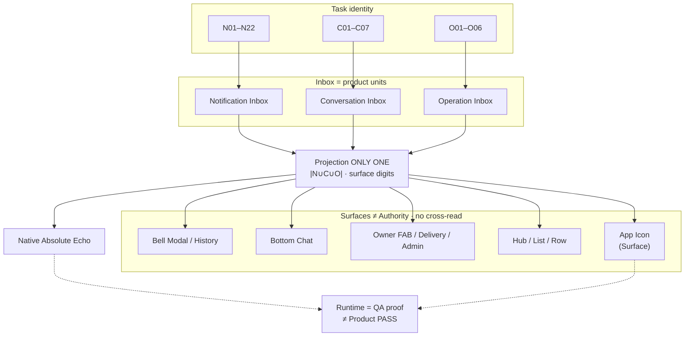

# R0 — Information Architecture Lock

**Status:** **R0 INFORMATION ARCHITECTURE LOCK — APPROVED** (팀장 2026-08-03)  
**승인 조건:** 아래 §C 조건 1–5 + 새 Surface 금지 → Bible §A · 본 문서 반영 완료  
**구현(R1~):** **NOT APPROVED** · R1 보류 · **다음 R0.5-A Expected Matrix**  
**Mode:** 문서 LOCK · **코드 수정 없음**  
**선행:** P0 Formula · P1 COMPLETE · P2 Decision APPROVED  
**정의:** DIBAY Badge는 Badge 시스템이 아니라 **Task 추적 시스템**이다.

---

## 0. 왜 R0가 필요한가

P2 REBUILD 다섯 조각은 **하나의 Information Architecture**다. 따로 구현하면 다시 터진다.

```text
실패 1차 원인 = Information Architecture 미잠금
(Publisher 조각 단독이 아님)
```

**승인된 순서:**

```text
R0       Information Architecture Lock   ← APPROVED
R0.5-A   Expected Result Matrix          ← LOCK APPROVED
R0.5-B   실기 Trace                      ← 다음 (Expected 100%)
R1       Projection Contract             ← Wave PASS 후
R2       Surface
R3       Publisher
R4       Native
         Runtime (QA)
```

구 `R1 Icon → R2 Bottom → R3 Bell` = **SUPERSEDED**.  
Native/Cap **DEFER** until R0–R3 제품 잠금.

---

## C. R0 승인 조건 (5 + Surface 추가 금지)

### 조건 1 — Surface는 Authority가 아니다

```text
Task → Inbox → Projection → Surface → Native → Runtime
```

**전부 Surface (Authority 아님):**  
Bell · Bottom · FAB · Hub · List · **App Icon** · 기타 UI counter.

### 조건 2 — Surface는 서로 참조하면 안 된다

```text
금지:  App Icon ← Bell 읽음 · Bottom ← Icon · …
필수:  Task → Inbox → Projection → Bell
       Task → Inbox → Projection → App Icon
```

Surface끼리 읽지 않는다.

### 조건 3 — Projection ONLY ONE

```text
금지: Publisher A/B · Projection A/B
→ 재발: 20 vs 22
계약: Projection = ONLY ONE
```

### 조건 4 — Native는 마지막 Echo

```text
금지: Native → Badge 계산
필수: Projection → Absolute Echo → Native
```

Native는 계산하지 않는다.

### 조건 5 — Runtime는 증명이지 권위가 아니다

> **Runtime PASS ≠ Product PASS.**  
> Runtime은 Authority를 증명하는 **QA**이다. Authority가 아니다.

### 추가 규칙 — R0 LOCK 이후 새 Surface 금지

Bell / Bottom / FAB / 새 탭 / 새 Badge / 새 Counter —  
**R0 수정 승인 없이 추가 금지.** (6개월 후 붕괴 방지)

Bible 동기화: `DIBAY-BADGE-PRODUCT-BIBLE.md` **§A Architecture Authority Chain**.

---

## 1. IA 한 장 구조도 (잠금 · Projection 포함)

필수 축:

```text
Task
  ↓
Inbox          (N / C / O)
  ↓
Projection     (ONLY ONE)
  ↓
Surface        (Bell · Bottom · Owner/FAB · Hub · List · App Icon)
  ↓
Native         (Absolute Echo)
  ↓
Runtime        (QA · ≠ Product PASS)
```



```text
                         ┌─────────────────────────────────────┐
                         │           TASK (identity)            │
                         └──────────────────┬──────────────────┘
              ┌─────────────────────────────┼─────────────────────────────┐
              ▼                             ▼                             ▼
        Notification                  Conversation                   Operation
           Inbox                         Inbox                         Inbox
              └─────────────────────────────┬─────────────────────────────┘
                                            ▼
                         ┌─────────────────────────────────────┐
                         │     PROJECTION  (ONLY ONE)           │
                         │  집합 · ∪ · 표면 digit 유일 계산      │
                         └──────────────────┬──────────────────┘
          ┌─────────────┬─────────────┬─────┴─────┬─────────────┐
          ▼             ▼             ▼           ▼             ▼
        Bell         Bottom        Owner/FAB    Hub/List    App Icon
      (Surface)    (Surface)     (Surface)    (Surface)   (Surface)
          └─────────────┴─────────────┴───────────┴─────────────┘
                                            │
                         (Surface 상호 참조 금지 · 전부 Projection만)
                                            ▼
                         ┌─────────────────────────────────────┐
                         │  Native = Projection Absolute Echo   │
                         └──────────────────┬──────────────────┘
                                            ▼
                         ┌─────────────────────────────────────┐
                         │  Runtime = QA 증명 · ≠ Product PASS  │
                         └─────────────────────────────────────┘
```

**불변**

1. 모든 Task는 Inbox 하나를 거친다.  
2. **Projection만** 계산한다. Surface는 투영만.  
3. Surface끼리 참조하지 않는다.  
4. App Icon도 Surface다 (Authority 아님).  
5. Native는 echo only.  
6. Runtime은 QA다.

---

## 2. Task → Inbox → Projection → Surface 전 연결

경로 공통: `Task → Inbox → Projection → Surface(s) → Native`.

### 2.1 Notification → N → Projection → Surfaces

| Task | Inbox | Surfaces (← Projection) | Completion |
|------|-------|-------------------------|------------|
| N01–N03, N05–N22 | N | Bell Modal(N), History(회원), App Icon | 읽음·삭제·Archive |
| N04 배너 only | — | Digit/Icon 없음 | N/A |

### 2.2 Conversation → C → Projection → Surfaces

| Task | Inbox | Surfaces | Completion |
|------|-------|----------|------------|
| C01 General | C | Bottom, GD Hub, Row, App Icon | Read ACK |
| C02 Group | C | Bottom, Group Hub, Row, App Icon | Read ACK |
| C03 Trade | C | Bottom, Trade Hub, Row, App Icon | Read ACK |
| C04 Customer Order | C | Bottom, Order Hub, Row, App Icon | Read ACK |
| C05 Owner Chat | C | FAB, Delivery, Row, App Icon (**∉ Bottom**) | Read ACK |
| C06 동일방 추가 | C | Row↑ · Hub/Bottom/Icon 유지1 | Read ACK |
| C07 Room-bound 부재중 | C | Row/방 · App Icon | 정책 ACK |

**Bottom Chat 집합:** C01∪C02∪C03∪C04 only.

### 2.3 Operation → O → Projection → Surfaces

| Task | Inbox | Surfaces | Completion |
|------|-------|----------|------------|
| O01–O06 | O | O_bell, FAB, Delivery, Admin, App Icon | 접수/완료/취소 등 |

동일 `operation:…` → 다 Surface 표시 · Icon ∪ **1** (Projection).

---

## 3. Surface ← Projection ← Inbox (역방향)

| Surface | Inbox 소스 | Task IDs | Authority? |
|---------|------------|----------|------------|
| Bell Modal N | N | N* | NO |
| Bell Modal O_bell | O | O* | NO |
| Bell History | N · O | N* · O* | NO |
| Bottom Chat | C | C01–C04, C06 | NO |
| Hub / Row / List | C | C01–C07 | NO |
| Delivery / FAB | O ∪ C05 | O*, C05 | NO |
| Store Admin | O | O* | NO |
| **App Icon** | N ∪ C ∪ O | 전 active | **NO (Surface)** |
| Native | echo Projection | = Icon 집합 | NO (echo) |
| Runtime | — | — | NO (QA) |

---

## 4. P2 Decision → IA → 이후 Phase

| P2 | IA | Phase |
|----|-----|--------|
| KEEP Writer/ACK/OwnerChat∈C/O축 | Task→Inbox | 유지 |
| REBUILD Icon∪ · Owner 투영 · Bottom · Bell | Projection + Surface | **R0.5-A Oracle** → R0.5-B → R1 → R2 → R3 |
| DEFER Native | Native echo | **R4** |

---

## 5. R0 LOCK 체크리스트

- [x] 축: Task → Inbox → **Projection** → Surface → Native → Runtime  
- [x] 조건1 Surface ≠ Authority (App Icon 포함)  
- [x] 조건2 Surface 상호참조 금지  
- [x] 조건3 Projection ONLY ONE  
- [x] 조건4 Native Absolute Echo  
- [x] 조건5 Runtime ≠ Product PASS  
- [x] 새 Surface 추가 금지 (R0 개정 승인 전)  
- [x] N/C/O Task 전 연결  
- [x] Bible §A 동기화  
- [x] **R0 APPROVED**

**구현(R1~) · Runtime 코드:** 별도 승인 전 **금지**.

---

## 6. 마지막 문장 (조건 5 · 프로젝트 최중요)

> **Runtime PASS ≠ Product PASS.**  
> Runtime는 Authority를 증명하는 QA이지, Authority가 아니다.

---

## 7. 한 줄

**Badge 중심이 아니라 Task → Inbox → Projection(ONLY ONE) → Surface → Native → Runtime(QA)이다. Surface는 권위가 아니고, 서로 읽지 않으며, 새 Surface는 R0 개정 없이 추가하지 않는다.**
