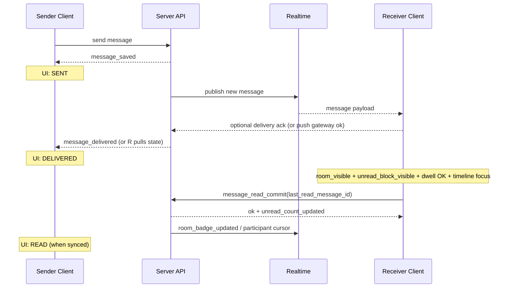
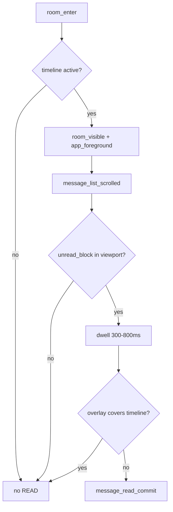

# SAMARKET 메신저 — 메시지 상태·읽음 처리(SENT / DELIVERED / READ) 아키텍처

> **범위**: `SENT` · `DELIVERED` · `READ` 만 정의한다.  
> **비범위**: ONLINE / AWAY / OFFLINE(프레즌스) — **메시지 읽음과 절대 결합하지 않는다.**

---

## 1. SENT / DELIVERED / READ 최종 정의서

### 1.1 SENT

| 항목 | 내용 |
|------|------|
| **의미** | 발신자가 보낸 메시지가 **서버에 정상 영속 저장**되었음을 보증하는 상태 |
| **관점** | **Sender** — “서버 접수 완료” |
| **전환 조건** | `message_saved` 확정(트랜잭션 커밋·저장소 write 성공) 직후 |
| **UI** | 단일 체크/시계 등 “전송됨” 표시(제품 카피는 별도) |
| **주의** | SENT는 상대에게 **물리적으로 전달**되었음을 뜻하지 않는다 |

### 1.2 DELIVERED

| 항목 | 내용 |
|------|------|
| **의미** | 메시지가 **수신자 측 활성 수신 경로**에 도달했음을 의미. **읽음 아님** |
| **관점** | Sender — “상대 **디바이스/세션으로 배달됨**” (읽었는지는 별개) |
| **전환 조건(OR, 제품 정책으로 명시)** | (a) **실시간 채널**로 해당 `room_id`에서 수신 클라이언트가 메시지 페이로드 수신·검증 성공, 또는 (b) **푸시 전송**이 “수신 가능한 단말로의 전달” 기준 성공(플랫폼 정책에 맞는 정의) |
| **UI** | “배달됨” 이중 체크 등(제품) — READ와 **시각적으로 분리** |
| **주의** | DELIVERED ≠ READ. 온라인·같은 방 여부와 **무관**하게 정의할 것 |

### 1.3 READ

| 항목 | 내용 |
|------|------|
| **의미** | **수신자**가 해당 채팅방에서, **해당 unread 메시지(블록)**를 **실제 뷰포트에 노출**해 **인지 가능한 최소 시간** 동안 본 경우 |
| **관점** | Sender — “상대가 **그 메시지를 실제로 봤다**” |
| **전환 조건** | 아래 **§3 READ 처리 조건 체크리스트**를 **모두** 만족할 때만 `message_read` / `last_read_*` 갱신 |
| **UI** | READ 표시(색 채움 체크 등). 그룹 1차는 **per-user 커서**만 |

**온라인 상태와의 분리(재확인)**  
- 상대가 ONLINE이어도 메시지를 **안 볼 수 있다** → READ 아님.  
- 같은 방에 있어도 **최신 줄을 안 보면** READ 아님.

---

## 2. READ 처리 조건 체크리스트 (모두 충족 시에만 READ)

- [ ] **R1** Receiver가 해당 **room에 실제 진입**해 있다(라우트/스택 상 “대화 타임라인”이 활성).
- [ ] **R2** 앱 또는 **웹 탭이 포그라운드·활성**(hidden/background 아님).
- [ ] **R3** 해당 **unread 메시지(또는 연속 unread 블록의 대표 메시지)**가 **뷰포트 안**에 들어와 있다(IntersectionObserver 등으로 **가시 비율·기준선** 명시).
- [ ] **R4** **최소 노출 시간** 충족 — 권장 **300ms ~ 800ms**(제품 단일 상수로 고정, A/B는 별도).
- [ ] **R5** 현재 화면이 **메시지 리스트(타임라인)** 이다 — 상단 정보만, 프로필만, 첨부 상세만, 설정만이면 **불가**.
- [ ] **R6** `document.visibilityState === 'visible'`(웹) / 앱 lifecycle foreground 동등 조건.
- [ ] **R7** **읽음 커밋**은 **idempotent** API(아래 §9)로 보내며, “한 번에 올린 커서”는 **실제로 본 최신 메시지 id**에 맞춘다.

---

## 3. 절대 READ가 되면 안 되는 조건 체크리스트

- [ ] **N1** 방에 들어왔지만 **타임라인 로딩 중**이거나 메시지 **placeholder**만 보임.
- [ ] **N2** 방에 있으나 **스크롤이 위쪽**이라 **최신 unread가 뷰포트 밖**.
- [ ] **N3** **헤더 메뉴 / 프로필 / 이미지 풀스크린 / 파일 상세 / 설정** 등 **오버레이**가 타임라인 위를 가림.
- [ ] **N4** **알림 배너·푸시 미리보기**만 확인(방 타임라인 미표시).
- [ ] **N5** **Background / 비활성 탭 / minimized**.
- [ ] **N6** **소켓만 연결**됨 — DELIVERED 경로만 성공.
- [ ] **N7** 메시지는 DELIVERED였으나 **뷰포트에 안 들어옴**.
- [ ] **N8** **통화·시스템·다른 모달**이 최상단에 있어 unread 블록이 **가려짐**.
- [ ] **N9** unread 블록이 **짧게(< 최소 노출 시간)**만 보였다가 스크롤 아웃.
- [ ] **N10** **중복 read 커밋**을 막기 전 클라이언트가 잘못된 `last_read_message_id`를 보내는 경우(서버는 커서 **단조 증가**만 허용).

---

## 4. unread_count 갱신 로직

### 4.1 원칙

- `unread_count`는 **READ 커밋**과 **동기화**한다.  
- **room_enter**, **DELIVERED**, **socket connect**만으로는 **감소시키지 않는다**.

### 4.2 권장 계산(서버 단일 진실)

**1차(가벼움)** — participant 커서:

- `last_read_message_id` / `last_read_at` 를 receiver 기준으로 갱신.
- `unread_count`는  
  - **증가**: 새 메시지 insert 시 “다른 참가자”에 대해 규칙적 증가(기존 CM/채팅 도메인 RPC 패턴 유지), **또는**  
  - **감소/정합**: READ 커밋 시 “`created_at`/`id`가 커서보다 큰 메시지 수”로 **재계산** 또는 **0으로 리셋 + 카운트** (부하 허용 범위에서 선택).

**그룹(1차)**  
- 메시지별 `read_users[]` **저장 금지**.  
- 사용자별 `last_read_message_id` / `unread_count`만.

### 4.3 READ 커밋 시 서버 처리(개요)

1. 인증·room 멤버십 검증.  
2. `last_read_message_id_new`가 **단조**(기존보다 “더 최신” 메시지를 가리킴)인지 검증.  
3. `last_read_at` 갱신.  
4. `unread_count`를 정책에 맞게 갱신(0 클리핑).  
5. `unread_count_updated` / `room_badge_updated` 이벤트(내부·Realtime) 발행.  
6. **Idempotency**: 동일 커서 재전송 → 200, 부작용 없음.

---

## 5. 배지 리셋 규칙

| 트리거 | 배지/리스트 unread | 허용 여부 |
|--------|---------------------|-----------|
| READ 커밋 성공(§2 전부 충족) | 방별·전역 배지 감소 | ✅ |
| room_enter만 | 감소 | ❌ |
| DELIVERED만 | 감소 | ❌ |
| 같은 방만 | 감소 | ❌ |
| 포그라운드만 | 감소 | ❌ |

- **채팅 리스트** 방별 배지 = 서버 `unread_count`(또는 동일 SSOT).  
- **앱 전역** 배지 = 집계 API가 READ 반영 후 값.  
- **방 내부** unread divider = READ 커밋 후 클라이언트가 스크롤/커서와 정합.

---

## 6. 알림음 / 인앱 알림 종료 규칙

| 이벤트 | 알림음·강조 |
|--------|-------------|
| **DELIVERED / 수신** | 알림음·토스트 **발생 가능**(도메인·뮤트·CASE 규칙은 기존 `notif-0002` 등과 정합) |
| **READ** | 해당 메시지·블록 기준 **unread 해제** → **반복 강조 중지**, 배지·divider 정리 |
| **room_enter** | 알림 **강제 종료 금지** |
| **delivered만** | 배지·unread **유지** |

- “알림음은 왔을 수 있지만, **읽음 처리는 READ 이후**”를 사용자 경험으로 고정한다.

---

## 7. 같은 방에 있어도 READ가 아닌 사례 표

| # | 상황 | READ | unread / 배지 |
|---|------|------|----------------|
| 1 | 같은 방, 스크롤 위로 올려 **최신 unread 미노출** | ❌ | 유지 |
| 2 | 같은 방, **이미지 뷰어**만 전체 화면 | ❌ | 유지 |
| 3 | 같은 방, **상대 프로필** 시트만 | ❌ | 유지 |
| 4 | 같은 방, **설정** 화면 | ❌ | 유지 |
| 5 | 같은 방, **로딩 스켈레톤**만 | ❌ | 유지 |
| 6 | 같은 방, 하단 스크롤 완료 후 **unread가 뷰포트 + 노출 시간** 충족 | ✅ | READ 후 감소 |
| 7 | 같은 방, **백그라운드**로 전환 직전 100ms 노출 | ❌(R4/R6 실패 가능) | 유지 |
| 8 | 같은 방, **멀티탭** 중 비활성 탭 | ❌ | 유지(활성 탭만 READ 커밋) |

---

## 8. 상태 전이표

### 8.1 메시지 단위(발신자 시점)

```
                    message_saved
                         │
                         ▼
                      [ SENT ]
                         │
         ┌───────────────┴───────────────┐
         │ message_delivered              │ (수신 경로 도달)
         ▼                                │
    [ DELIVERED ]                         │
         │                                │
         │ message_read                   │ (수신자 READ 조건 충족 + 커밋)
         ▼                                │
      [ READ ] ◄──────────────────────────┘
```

- **역방향 전환 없음**(READ → DELIVERED 불가).  
- **재전송·수정**은 별도 메시지 id 정책.

### 8.2 수신자 unread(방 참가자)

```
unread_count > 0
       │
       │ READ 커밋(커서 전진)
       ▼
unread_count == 0  (또는 정책상 잔여 시스템 메시지 제외)
```

---

## 9. 가벼운 DB 구조(권장)

### 9.1 메시지(개념)

```text
messages
  id
  room_id
  sender_id
  body (또는 content)
  created_at
  -- 선택: delivery/read 는 participant 커서로 충분하면 메시지 테이블에 read 배열 두지 않음
```

### 9.2 방 참가자(핵심)

```text
room_participants  -- (CM: community_messenger_participants / 거래: chat_room_participants 등 도메인별 테이블이면 동일 “개념”)
  room_id
  user_id
  last_delivered_message_id   -- 선택: DELIVERED 커서(제품이 이중체크에 필요할 때)
  last_read_message_id
  last_read_at
  unread_count
  updated_at
```

- **금지**: 메시지 행마다 `read_users[]` 기본 저장.  
- **그룹 1차**: 멤버별 `last_read_message_id` + `unread_count`.  
- **DELIVERED**: participant 컬럼 또는 별도 “디바이스 세션” 테이블(2차) — 1차는 Realtime 수신 ack만으로도 가능.

### 9.3 Idempotency

- 클라이언트: `message_read_commit`에 `client_read_nonce` 또는 `If-Match` 스타일 버전(선택).  
- 서버: 동일 `last_read_message_id` 재요청 → 성공, 상태 변경 없음.

---

## 10. 클라이언트 / 서버 이벤트 흐름도

### 10.1 전송·배달·읽음(개념 시퀀스)



### 10.2 클라이언트 이벤트 → READ 게이트



### 10.3 서버 이벤트(내부)

| 이벤트 | 의미 |
|--------|------|
| `message_saved` | SENT 확정 |
| `message_delivered` | DELIVERED 확정(정책 정의에 따름) |
| `message_read` | READ 커밋 처리 |
| `unread_count_updated` | participant unread 갱신 |
| `room_badge_updated` | 집계·푸시 배지 등 후속 |

---

## 11. 예외 케이스 정의

| # | 케이스 | 처리 |
|---|--------|------|
| 1 | 같은 방, 위쪽 옛 대화만 읽음 | READ **금지**, 커서/배지 유지 |
| 2 | 진입 직후 프로필/상세로 이동 | READ **금지** |
| 3 | 이미지 로딩 느림 | **콘텐츠 bbox**가 뷰포트에 들어온 뒤 dwell 시작(플레이스홀더만이면 미카운트) |
| 4 | 웹 멀티 탭 | **활성 탭만** READ 커밋; BroadcastChannel 등으로 “다른 탭은 커서 동기만” |
| 5 | 모바일+웹 동시 로그인 | **디바이스별** DELIVERED 가능; READ는 **실제 본 디바이스**에서만 커밋 |
| 6 | 읽음 중복 전송 | 서버 **idempotent** + 커서 단조 |
| 7 | reconnect 후 중복 read | 동일 |
| 8 | 메시지 폭주 | 커밋은 **throttle/debounce** + “가장 최신 본 id” 한 번 전송 |
| 9 | unread 살짝 보였다 스크롤 아웃 | dwell 미충족 → READ **아님** |
| 10 | 통화·오버레이 | 타임라인 가림 시 READ **금지** |

---

## 12. 잘못된 기준(금지) — 왜 틀린가

| 잘못된 기준 | 왜 틀린가 |
|-------------|-----------|
| **방 입장 = 전체 읽음** | 사용자는 **타이틀·검색·이전 스크롤**만 할 수 있다. 배지·상대 기대와 불일치. |
| **앱 켜짐 = 읽음** | 포그라운드는 **READ의 필요 조건 일부**일 뿐, **충분 조건 아님**. |
| **온라인 = 읽음** | 프레즌스와 읽음은 **독립 변수**. 온라인은 “지금 대화 화면을 보는 중”이 아니다. |
| **DELIVERED = 읽음** | 배달은 **네트워크·세션** 개념; 읽음은 **인지·주의** 개념. 실서비스도 분리한다. |
| **같은 방 = 읽음** | **뷰포트**가 최신 unread를 포함하지 않으면 **읽지 않은 것**과 동일하다. |

---

## 13. 현재 코드베이스와의 정렬 노트(구현 시)

- `useMessengerRoomOpenMarkReadEffect`의 **하단 체류 + 포커스 + unreadCount** 방향은 본 문서의 **viewport + dwell + 포그라운드**와 **정합**시켜야 한다.  
- **“스크롤이 위에 있을 때 최신 unread는 READ 금지”**는 `stickToBottomRef` / 가상 스크롤 **가시 범위**와 명시적으로 연결할 것.  
- **레거시 거래 `item_trade` + CM 병행** 구간은 READ 커밋 시 **동일 커서 원칙**으로 `last_read_message_id`를 양쪽 도메인에 동기화(이미 일부 반영됨).  
- 배지·알림은 **READ 이후**만 감소·해제하도록 집계 SSOT를 유지한다.

---

## 문서 메타

- **문서 ID**: `messenger-read-receipt-v1`  
- **상태**: 확정(아키텍처 기준) — 세부 상수( dwell ms, 가시 비율 %)는 구현 티켓에서 고정  
- **다음 확장**: 그룹 per-message read receipt(표시만, 저장은 여전히 가벼운 커서 우선)
